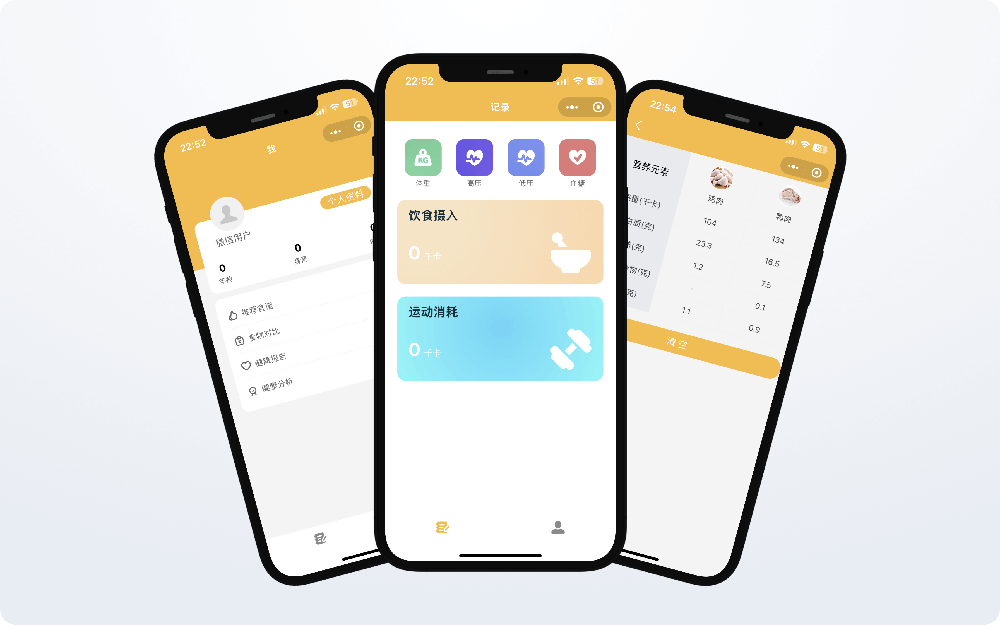

# 健康助手

> [!IMPORTANT]
> 如需项目后端 (Java) 代码支持，请 [点击提交表单](https://pr622qgytz.feishu.cn/share/base/form/shrcnPZelendm4ljXVg8hsuJGtd)

## 功能

## 使用
- 克隆或下载此项目
- 使用 [Visual Studio Code](https://code.visualstudio.com/) 打开该项目
- 安装并使用 [pnpm](https://pnpm.io/) 安装依赖
- 在项目根目录运行 `pnpm dev` 启动本地服务
- 在微信开发者工具导入 `dist` 目录下的小程序代码

## 参与贡献
- Fork 该项目
- 创建一条分支 `git checkout -b feat/AmazingFeature`
- 提交你的更改内容 `git commit -m 'Add some AmazingFeature'`
- 推送到该分支 `git push origin feat/AmazingFeature`
- 提交 PR

## License

[MIT](https://github.com/leon-fong/health-helper/blob/main/LICENSE)
