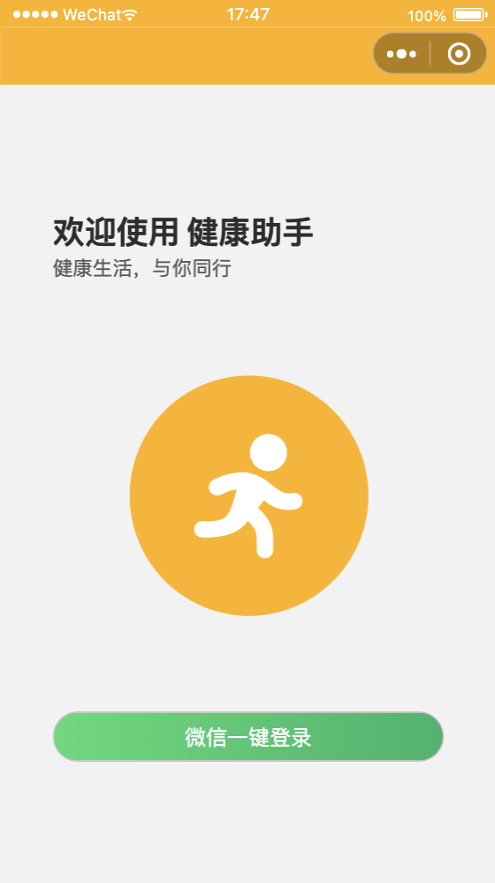
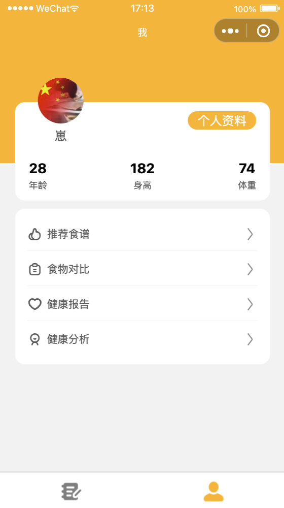

<h1 align="center">🍎 健康助手小程序 🏃‍♂️</h1>

一款帮您记录饮食、运动的健康小程序

 

 

### 🌟 功能
- 记录饮食（早中晚）、运动的数据 📊
- 自动生成健康报告/分析 📈
- 个性化推荐食谱 🍲
- 智能计算推荐摄入蛋白质 🥚
- 食物多项数据含量对比 📊
- 同步微信步数 🏃

### 🚀 使用
- 克隆或下载此项目 📥
- 使用 [Visual Studio Code](https://code.visualstudio.com/) 打开该项目 🔍
- 安装并使用 [pnpm](https://pnpm.io/) 安装依赖 📦
- 在项目根目录运行 `pnpm dev` 启动本地服务 🚀
- 在微信开发者工具导入 `dist` 目录下的小程序代码 📱

### 👥 参与贡献
- Fork 该项目
- 创建一条分支 `git checkout -b feat/AmazingFeature`
- 提交你的更改内容 `git commit -m 'Add some AmazingFeature'`
- 推送到该分支 `git push origin feat/AmazingFeature`
- 提交 PR

> 如需项目后端 (JAVA) 代码支持，请联系 `ooohmydawn@hotmail.com`

### 📝 License

MIT License © 2022 Leon Fong
